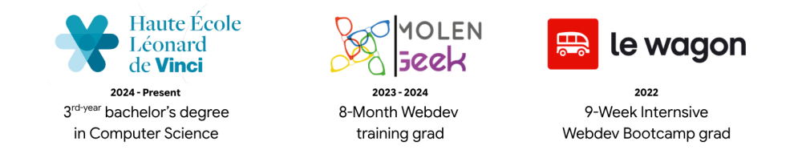
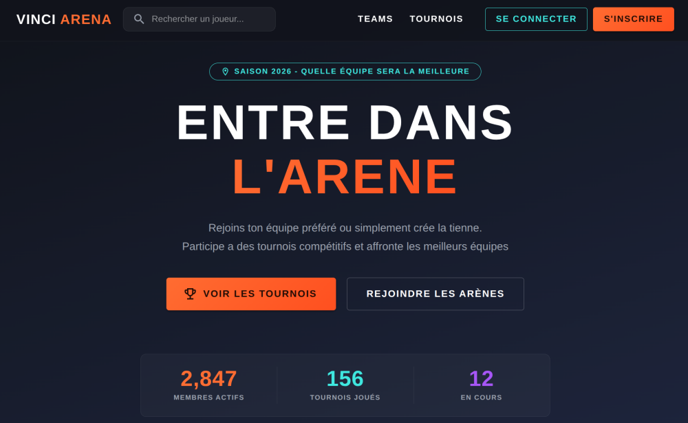
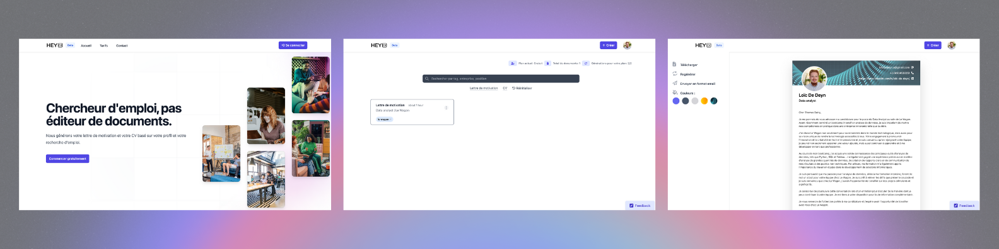

# Hello World From Belgium !

My name is Loïc De Deyn and I am currenly in **3rd year of my bachelor's degree** at Haute École Léonard de Vinci in Brussels.

### My academic journey

## Some Projects
### Vinci Arena - An e-sports tournaments management app (2026)

#### Tasks
* Built an **e-sports tournament management app** in a 5-person Agile team.
* Developed the **Java/Spring Boot backend** and designed the database.
* Used **Conventional Commits** and Git branching practices.

### HeyCV - A Resume & Cover letter builder (2022)

#### Tasks
* Built an AI-powered resume and cover letter platform with OpenAI, inline editing, and PDF generation.
* Implemented authentication, Stripe payments, and a dashboard with search and tagging using Rails, Hotwire, Tailwind CSS, and Alpine.js.
* Reached 30 beta users, including 1 paying customer.

### Github Collab Repository - Chrome extension (2023)

**[Visit on Chrome Web Store](https://chromewebstore.google.com/detail/idkhlnimdodjfdmecakpmeldhcmopnci?utm_source=item-share-cb)**
#### Tasks
* Built a vanilla JavaScript a Chrome extension to access all GitHub repositories, including collaborator repos.

#### Bridge23.xyz - Landing Page (2024)

**[Visit Bridge23.xyz](https://www.bridge23.xyz/)**
#### Tasks
* Built a **modern landing page** for a tool aimed at indie game developers.
* Used Next.js, i18n, and Radix UI Primitives.

## More about me
* **LinkedIn profile**: [loic-dedeyn](https://www.linkedin.com/in/loic-dedeyn/)
* **What I love to listen to:** [Obsidian Soundfields](https://www.youtube.com/watch?v=C9eO5qVwzUM), [Ambient Outpost](https://www.youtube.com/watch?v=UnaXM6ceHks), [Focus Soundscapes](https://www.youtube.com/watch?v=uVzR87nfHmM)
* **Watch me:** [at Thales](https://www.youtube.com/watch?v=-7zgigwTMG4&list=PLypm7oU4utZUFS18S7KDdzWjPs6IQrjsq&index=6), [at CyberSquad](https://www.tiktok.com/@cybersquadbe/video/7335499990644624673)
